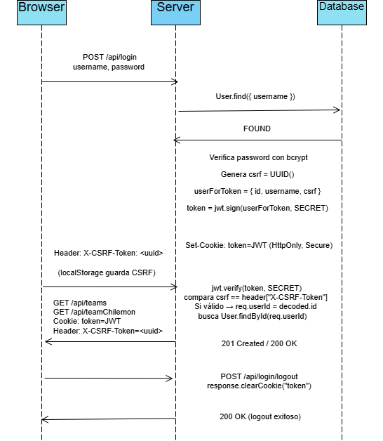

# Chilemon-Showdown
Proyecto para CC5003 - Aplicaciones Web Reactivas. Primavera 2025.

## Descripción del proyecto 

Hoy la comunidad chilena que juega simuladores PvP debe usar plataformas globales (idioma, 
latencia, eventos y horarios no alineados). Con Chilémon Showdown © queremos cambiar eso: 
reemplazar los nombres de los Pokémones por referencias a la cultura chilena y que los 
jugadores puedan encontrar batallas en una modalidad horaria más cercana a su contraparte. 
Queremos que los usuarios compitan en línea por turnos asíncronos, seleccionando equipos 
de “pokemon” con nombres inspirados en la cultura local.

En esta aplicación web, el usuario será capaz de crear su propio equipo de chilémon, y lanzarse a batallar
contra personas de todo el país!

## Estructura del Estado Global
Se utiliza zustand para la gestión del estado global en la aplicación frontend. 
Se definen tres stores principales para manejar los estados de las batallas: pendientes, en curso y finalizadas. Pendientes almacena las batallas que están esperando a que los jugadores se unan, en curso contiene las batallas activas donde los jugadores están participando, y finalizadas guarda las batallas que ya han concluido.

## Mapa de rutas y flujo de autenticación

### Mapa de rutas

```bash
/api
 ├── /login               
 │     ├── /                    (POST)    - Iniciar sesión
 │     ├── /me                  (GET)     - Obtener usuario autenticado
 │     └── /logout              (POST)    - Cerrar sesión
 ├── /users
 │     ├── /                    (GET)     - Obtener todos los usuarios
 │     └── /                    (POST)    - Registrar nuevo usuario
 ├── /chilemon
 │     ├── /                    (GET)     - Lista de todos los chilemon
 │     └── /:id                 (GET)     - Obtener Chilemon por ID
 ├── /team
 │     ├── /teams               (GET)     - Obtener todos los equipos del usuario
 │     ├── /teams/:id           (GET)     - Obtener equipo único por ID
 │     ├── /teams               (POST)    - Crear un nuevo equipo
 │     ├── /teams/:id           (PUT)     - Actualizar un equipo
 │     ├── /teams/:id           (DELETE)  - Eliminar un equipo
 │     └── /teamChilemon        (GET)     - Obtener chilemon, miembros de un equipo
 ├── /battles
 │     ├── /battles/:id         (GET)     - Obtener todos los equipos del usuario
 │     ├── /userId/:battles     (GET)     - Obtener todas las batallas donde participa UserId
 │     ├── /battles             (POST)    - Crea una batalla o se une a una en estado waiting
 │     ├── /battles/:id/move    (GET)     - Obtener todos los equipos del usuario
 │     ├── /battles/:id/switch  (GET)     - Obtener todos los equipos del usuario
 │     └── /battles/:id/forfeit (GET)     - Obtener todos los equipos del usuario
 ├── /testing
 │     ├── /reset               (POST)    - Reinicia la base de datos para el testing E2E
 ```

### Flujo de autenticación


## Testing E2E

### Herramienta usada

La herramienta utilizada para el testing End-to-End es Playwright. Los tests están organizados en el directorio e2e-tests y se configuran mediante playwright.config.ts. El código de prueba se escribe usando la API de test y expect de Playwright.

### Flujos cubierto

Los tests E2E cubren los principales flujos de la gestión de equipos (Team Builder), que representan las operaciones CRUD (Create, Read, Update, Delete).

### Autenticación

1. Inicio de sesión: Verifica que, al ingresar credenciales válidas, el usuario es redirigido correctamente a la página de inicio (/*home*/).

2. Accesos protegidos: Verifica que la API protegida (/api/teams) retorna 401 (Unauthorized) si no se ha iniciado sesión. También una vez que el usuario inicia sesión (login), verifica que la misma ruta protegida ahora retorna 200 (OK), confirmando que la autenticación funciona correctamente.

### CRUD

1. Crear: Se simula la selección de 6 chilemon, se guarda un nombre del equipo, y se verifica que se guarde al presionar buardar.

2. Read: Se selecciona un equipo creado (como en el paso anterior por ejemplo), luego se verifica que los slots estén llenos por ls chilemon.

3. Update: Se prueba remover un chilemon, añadir el mismo o uno distinto y luego se guarda. Se vuelve a verificar los slots llenos y se compara la lista anterior con la nueva, confirmando el reemplazo.

4. Delete: Crea un equipo, configura Playwright para aceptar automáticamente la ventana de confirmación, y luego hace clic en el botón de eliminar asociado al equipo en la barra lateral. Se confirma que el equipo ya no sea visible en la barra lateral, verificando también el conteo de elementos con dicho nombre sea 0.


## Librería de estilos y decisiones de diseño

### Material UI

En el frontend se utilizó Material UI (MUI) como librería principal de componentes de interfaz. MUI provee componentes preconstruidos como Box, Button, TextField, Typography, Paper, IconButton, Alert y Avatar, que permiten mantener una línea visual consistente y un diseño responsive. Además, se incorporaron los íconos de @mui/icons-material (por ejemplo, SaveIcon, AddIcon, ArrowBackIcon y CloseIcon) para reforzar visualmente las acciones principales de la interfaz (guardar, volver, eliminar, etc.).


## Despliegue de la aplicación

URL aplicación desplegada: 

```bash
fullstack.dcc.uchile.cl:7142
```

Los pasos de construcción y despliegue fueron los siguientes:

1. En la carpeta de backend: 
```bash
npm run build:ui
npm run build
npm run seed
```

2. Subir al servidor la carpeta backend:
```bash
scp -P219 -r backend fullstack@fullstack.dcc.uchile.cl:elpepesin/chilemon
```

3. Dentro del servidor 
```bash
cd elpepesin/chilemon/backend
npm i
npm run start
```
